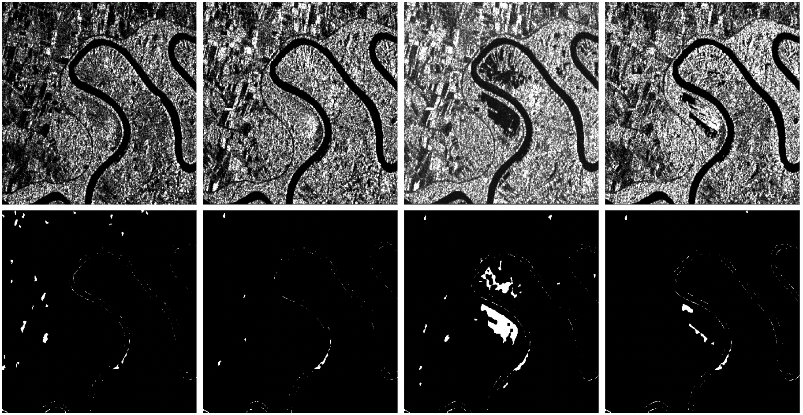

# Portraying the Need for Temporal Data in Flood Detection via Sentinel-1

This is the official implementation of "Portraying the Need for Temporal Data in Flood Detection via Sentinel-1", presented at [IGARSS24](https://www.2024.ieeeigarss.org/)🌍. The full paper ia available [here](https://arxiv.org/abs/2403.03671).

Identifying flood affected areas in remote sensing data is a critical problem in earth observation to analyze flood impact and drive responses. While a number of methods have been proposed in the literature, there are two main limitations in available flood detection datasets: (1) a lack of region variability is commonly observed and/or (2) they require to distinguish permanent water bodies from flooded areas from a single image, which becomes an ill-posed setup. Consequently, we extend the globally diverse MMFlood dataset [1] to multidate by providing one year of Sentinel-1 observations around each flood event. To our surprise, we notice that the definition of flooded pixels in MMFlood is inconsistent when observing the entire image sequence. Hence, we re-frame the flood detection task as a temporal anomaly detection problem, where anomalous water bodies are segmented from a Sentinel-1 temporal sequence. From this definition, we provide a simple method inspired by the popular video change detector ViBe [2], results of which quantitatively align with the SAR image time series, providing a reasonable baseline for future works.

[1] F. Montello, E. Arnaudo and C. Rossi. "MMFlood: A Multimodal Dataset for Flood Delineation From Satellite Imagery," in IEEE Access, vol. 10, pp. 96774-96787, 2022, doi: 10.1109/ACCESS.2022.3205419. 
[2] Barnich, Olivier, and Marc Van Droogenbroeck. "ViBe: A universal background subtraction algorithm for video sequences." IEEE Transactions on Image processing 20.6 (2010): 1709-1724.



## Requirements:
    numpy
    torch
    pillow
    opencv-python

## Data
You can download the extended multi-date **Temporal MMFlood** from the following [link](https://zenodo.org/records/12805033). Timeseries are provided only for the test set EMSR events of MMFlood (except EMSR162).

Place the unzipped data in `data/mmflood-multidate` withing the project's directory. If you desire, you can place your data at a different location. In such case, you will have to update the `data_root` variable in the bash scripts provided in the `scripts/` directory.

## Algorithm
The approach is completely unsupervised, and it is an adaptation of the popular background subtractor ViBe, which builds a background model to detect anomalous events at differnt locations in the image. The high-level steps of the algorithm are:
* Initialize a background model of sample_num samples at each pixel with a temporal median across a set of images.
* For each image, the number of observed water events at each pixel is evaluated. A pixel is classified as flood if the SAR processing computes a water event, and less than min_c water events are seen in the model at that location
* Finally, all non-anomalous (non-flood) pixels are updated with the new information at a random position in the stack of collected observations

## Usage :
You can just run the following command from the project's directory:

```Shell
bash scripts/predict_mmflood_test.sh
```
You can also run the detection on specific individual scenes by running the `scripts/run_flood_detection.bash` bash file instead.

## Contact
Xavier Bou\
Email: xavier.bou_hernandez@ens-paris-saclay.fr

### Citation
If you found our work useful, consider citing it as follows:
```bibtex
@article{Bou:2024,
      title={Portraying the Need for Temporal Data in Flood Detection via Sentinel-1}, 
      author={Xavier Bou and Thibaud Ehret and Rafael Grompone von Gioi and Jeremy Anger},
      year={2024},
      eprint={2403.03671},
      archivePrefix={arXiv},
      primaryClass={cs.CV},
      url={https://arxiv.org/abs/2403.03671}, 
}
```

### License and Acknowledgementgit a
This project is licensed under the [GNU Affero General Public License v3.0](LICENSE) - see the [LICENSE](LICENSE) file for details.